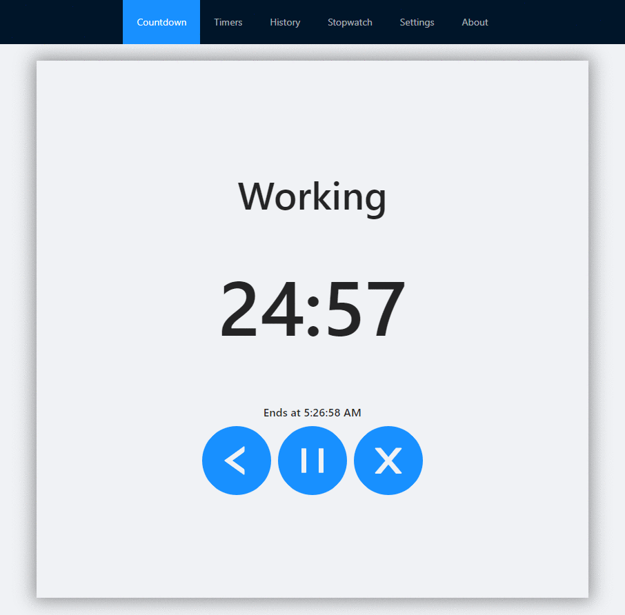

# Timer

Timer is a time keeping app for boosting productivity and focus. There are two types of clocks: countdown timer and stopwatch.

Live demo: https://www.timer.jasondip.com/

# Built With

Frontend: React, Ant Design

Hosting: Netlify

# Preview

# Features

-   Countdown Timer
-   Stopwatch Timer
-   Adjustable Settings

# Countdown Timer

Select a timer in the Timer page to begin counting down. Custom timers can be created and are saved between sessions in the browser's local storage.

The Countdown page has a view for the active timer, but does not need to be in focus to countdown.

The History page keeps a timeline of timers that have started, stopped, or finished.

# Stopwatch Timer

A simple stopwatch that counts up time.

# Adjustable Settings

The settings page allows you to change general settings and sound settings. The sound settings are for adjusting the sound that plays when a countdown timer has finished.
